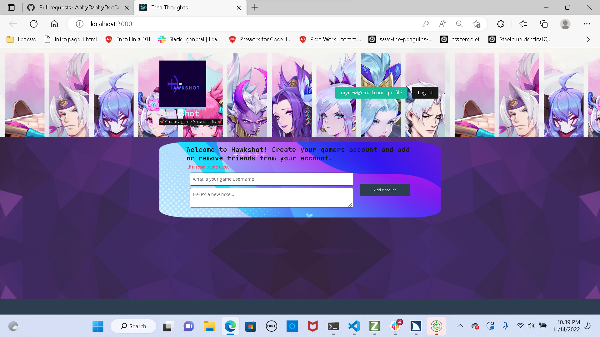

# Gaming-Friend-tracker-UW-project3

## User Story

```
AS A  gamer,
I WANT a better way to notate who friends are
SO THAT I play with people more frequently and get better matchups for my game mode
```


## Description

This is a MERN stack application that uses Mongodb for database, node.js, express.js, and React for front end.

## Table of Contents

- [installation](#installation)
- [Usage](#usage)
- [License](#license)
- [Contribution](#contribution)
- [Tests](#test)
- [Questions](#questions)

## Installation/Technologies
Heroku
MongoDb Attlis
NPM Apollo Client Package <br />
NPM Apollo-Server-Express Package<br />
NPM GraphQL Package<br />
NPM Bcrypt Package<br />
NPM Express.js Package<br />
NPM JSONWebToken<br />
NPM Mongoose Package<br />
Node.js<br />
NPM nodemon Package<br />
NPM JWT-Decode Package<br />
NPM React Package<br />
NPM React-Bootstrap<br />
React-Dom<br />
React-Router-Dom<br />
React-Scripts

## License


<br/> This application is licensed under [GNU](https://www.gnu.org/licenses/licenses.en.html).


## Contribution

University of Washington coding bootcamp Project 3:


## Test

To test thisapplication, please clone the repo and install the necessary npm dependencies. Type "npm run develop" from root directery of application
</br> For code review go to the [Github  repo](  https://github.com/teshome28sara/Gaming-Friend-tracker-UW-project3.git)
</br>For deployed site go to  [App]( https://mighty-garden-02354.herokuapp.com/)

## Questions
tes28sar@gmail.com
 

 ###  Screenshot

 


